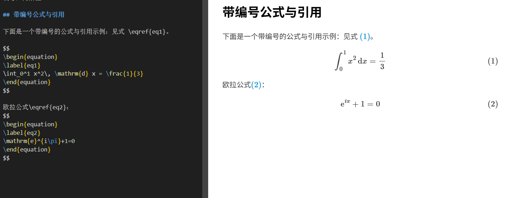

基于已有[markdown-preview-enhanced](https://github.com/shd101wyy/vscode-markdown-preview-enhanced)项目，支持正确预览基于latex的数学公式编号，简洁性、数学友好

## 带编号公式与引用
```
下面是一个带编号的公式与引用示例：见式 \eqref{eq1}。

$$
\begin{equation}
\label{eq1}
\int_0^1 x^2\, \mathrm{d} x = \frac{1}{3}
\end{equation}
$$

欧拉公式\eqref{eq2}：
$$
\begin{equation}
\label{eq2}
\mathrm{e}^{\mathrm{i}\pi}+1=0
\end{equation}
$$
```

## 安装教程（VS Code）

1. 下载本项目到本地（或直接克隆）。
2. VS Code 打开项目根目录。
3. 安装依赖：
	- 终端进入项目根目录，执行 `npm install`
4. 编译与打包：
	- 执行 `npm run build`
5. 运行扩展：
	- 按 `F5` 启动扩展开发宿主（Extension Development Host）。
6. 在新打开的 VS Code 窗口中，打开任意 Markdown 文件并预览即可。
